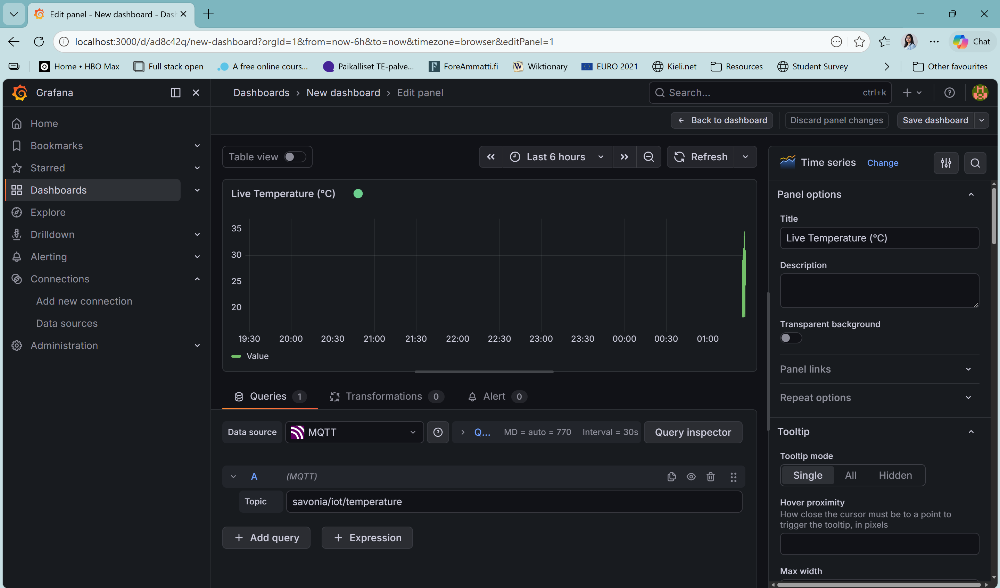

# Lab 1 — Real-Time MQTT Monitoring with Grafana

## System Overview

This lab builds a single-laptop IoT monitoring pipeline that simulates a two-laptop
setup using localhost. A Python sensor script sends simulated temperature data over
a TCP socket to an edge device script, which forwards it to a public MQTT broker.
Grafana subscribes to the MQTT topic and displays the values in a real-time dashboard.

socket_sensor.py  (Laptop 1 / simulated sensor)
│
│  TCP Socket — localhost:5005
▼
edge_device.py  (Laptop 2 / simulated edge device — same machine)
│
│  MQTT Publish
▼
broker.emqx.io (public MQTT broker)
│
│  MQTT Subscribe
▼
Grafana Dashboard  (localhost:3000)

---

## How to Run

### Requirements

Install the required Python library:

```bash
pip install paho-mqtt
```

### Step 1 — Start the edge device first

Open a terminal and run:

```bash
python edge_device.py
```

Wait until you see:
[Edge] Waiting for sensor to connect...

### Step 2 — Start the sensor

Open a second terminal and run:

```bash
python socket_sensor.py
```

You should see temperature values being sent and received every 2 seconds.

---

## Socket Data Flow

1. `socket_sensor.py` connects to `127.0.0.1:5005` using a TCP socket.
2. Every 2 seconds it generates a random temperature (18–35 °C) and sends it as a string.
3. `edge_device.py` listens on port 5005, receives the value, and immediately publishes
   it to the MQTT broker using the paho-mqtt library.
4. Grafana subscribes to the MQTT topic and displays incoming values in real time.

---

## MQTT Configuration

| Setting | Value |
|---------|-------|
| Broker | `broker.emqx.io` |
| Port | `1883` |
| Topic | `savonia/iot/temperature` |
| QoS | 1 |
| Protocol | MQTTv3.1.1 |

---

## Grafana Setup Instructions

### 1. Install Grafana on Windows

- Download the Windows installer from https://grafana.com/grafana/download?platform=windows
- Run the installer and follow the steps.
- After installation, Grafana starts automatically as a Windows service.
- Open your browser and go to: http://localhost:3000

### 2. Log in

- Username: `admin`
- Password: `admin`
- Change the password when prompted.

### 3. Install the MQTT data source plugin

1. Go to **Connections → Add new connection**
2. Search for **MQTT**
3. Click **Install** on the MQTT data source plugin
4. After installation, go to **Connections → Data sources → Add data source**
5. Select **MQTT**

### 4. Configure the MQTT data source

| Field | Value |
|-------|-------|
| Broker URL | `broker.emqx.io` |
| Port | `1883` |
| Client ID | (leave default or enter `grafana-client-01`) |
| Authentication | None |

Click **Save & Test** — you should see a green success message.

### 5. Create the dashboard

1. Go to **Dashboards → New Dashboard → Add visualization**
2. Select the **MQTT** data source
3. In the query editor, enter the topic: `savonia/iot/temperature`
4. Choose **Time series** as the visualization type
5. Rename the panel to: **Live Temperature (°C)**
6. Click **Apply**, then **Save dashboard**

---

## Grafana Dashboard Screenshot

> *(Screenshot of the Grafana dashboard showing live temperature values on a
> time-series panel. The Y-axis shows temperature in °C (range 18–35), the
> X-axis shows the last 5 minutes of data. Values update every 2 seconds.)*


```markdown

```

## What Is Shown in the Panel

The Grafana panel displays a live time-series graph of simulated temperature readings
(in °C) received over MQTT. Each data point represents one reading sent by the sensor
every 2 seconds. The panel updates automatically without refreshing the browser,
demonstrating real-time IoT monitoring.

---

## Limitation — Live-Only MQTT Visualization

The Grafana MQTT data source only shows data that arrives while the dashboard is
open in the browser. It does not store or log received MQTT messages. If Grafana
is closed or the browser tab is closed, all previously received values are lost and
cannot be retrieved. To enable historical graphs and data storage, a backend such as
**InfluxDB + Telegraf**, **Loki**, or another time-series database must be added to
the pipeline.

---

## Reflection Questions

**1. What is the role of Grafana in this system?**

Grafana acts as the visualization and monitoring layer. It subscribes to the MQTT
topic and renders incoming sensor values as a real-time graph. It gives operators an
immediate visual overview of system state without writing any custom frontend code.

**2. Why is MQTT useful for monitoring applications?**

MQTT is a lightweight publish/subscribe protocol designed for constrained devices and
unreliable networks. It requires very little bandwidth and code, supports many
simultaneous subscribers (e.g. Grafana + a database + a mobile app all listening to
the same topic at once), and has built-in Quality of Service (QoS) levels for reliable
delivery — making it ideal for IoT monitoring.

**3. What is the difference between live monitoring and historical storage?**

Live monitoring (what this lab does) shows only the data arriving right now — it is
useful for real-time alerting and observation but cannot answer questions like "what
was the temperature yesterday at 3 PM?". Historical storage writes every received
value to a database with a timestamp, enabling trend analysis, anomaly detection over
time, and reporting. A production IoT system typically needs both layers.
