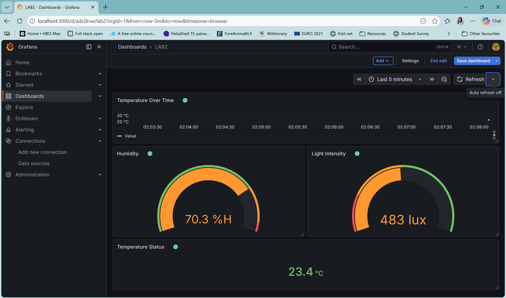

# Lab 2 — Multi-Sensor IoT Dashboard (4 Panels)

## System Overview

This lab extends the Lab 1 pipeline by adding humidity and light sensors to the data stream. All three sensor values are sent together over a TCP socket, split by the edge device, and published to three separate MQTT topics. Grafana subscribes to all three topics and displays them in a 4-panel real-time dashboard.

```
socket_sensor.py  (Laptop 1 / simulated sensor)
      │
      │  TCP Socket — localhost:5000
      │  Format: "temperature,humidity,light"
      ▼
edge_device.py  (Laptop 2 / simulated edge device — same machine)
      │
      ├─ MQTT Publish → savonia/iot/temperature
      ├─ MQTT Publish → savonia/iot/humidity
      └─ MQTT Publish → savonia/iot/light
      ▼
broker.emqx.io (public MQTT broker)
      │
      │  MQTT Subscribe (all 3 topics)
      ▼
Grafana Dashboard  (localhost:3000)
```

---

## Sensors Used

| Sensor | Simulated Range | Unit |
|--------|----------------|------|
| Temperature | 20.0 – 35.0 | °C |
| Humidity | 40.0 – 80.0 | % |
| Light | 100.0 – 1000.0 | lux |

All sensor values are generated randomly by `socket_sensor.py` to simulate real IoT hardware. They are sent as a comma-separated string every 5 seconds.

---

## MQTT Topics

| Topic | Sensor | Unit |
|-------|--------|------|
| `savonia/iot/temperature` | Temperature sensor | °C |
| `savonia/iot/humidity` | Humidity sensor | % |
| `savonia/iot/light` | Light sensor | lux |

- **Broker:** `broker.emqx.io`
- **Port:** `1883`
- **QoS:** 1

---

## How to Run

Install dependencies:

```bash
pip install paho-mqtt
```

Start edge device first (Terminal 1):

```bash
python edge_device.py
```

Start sensor (Terminal 2):

```bash
python socket_sensor.py
```

---

## Dashboard Layout

```
┌─────────────────────────────────────┐
│     Temperature Over Time           │
│     (Time series graph)             │
├──────────────────┬──────────────────┤
│   Humidity       │  Light Intensity │
│   (Gauge)        │  (Gauge)         │
├──────────────────┴──────────────────┤
│        Temperature Status           │
│        (Stat panel)                 │
└─────────────────────────────────────┘
```

**Panel 1 — Temperature Over Time** (Time series): Shows how temperature changes over the last few minutes. Y-axis is in °C, range 20–35.

**Panel 2 — Humidity** (Gauge): Displays current humidity percentage. Green below 70%, orange 70–78%, red above 78%.

**Panel 3 — Light Intensity** (Gauge): Displays current light level in lux. Red below 200 lux (dark), orange 200–500 lux, green above 500 lux (bright).

**Panel 4 — Temperature Status** (Stat): Shows the current temperature as a large number with color-coded status. Green below 30°C, orange 30–33°C, red above 33°C.

---

## Grafana Dashboard Screenshot

```

```
---

## Reflection — Why Separate MQTT Topics per Sensor?

Each sensor is published to its own MQTT topic because it allows any subscriber to independently choose which data it needs, without receiving unnecessary data. For example, a cooling system controller may only need to subscribe to the temperature topic, while a lighting automation system only needs the light topic. Mixing all sensor values into one topic would force every subscriber to receive and parse all data even the parts it does not use. Separate topics also make it easier to add new sensors later without changing existing subscriptions, and they allow different QoS levels, retention policies, and access controls to be applied per sensor independently.
