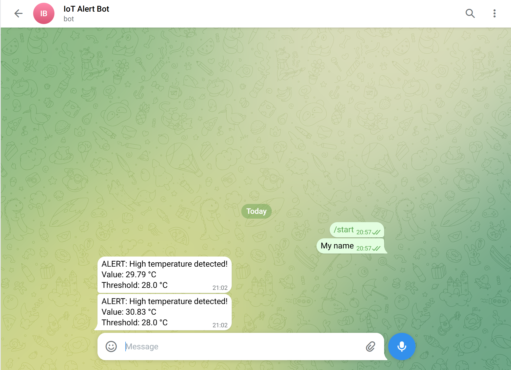

# Lab 4 — MQTT Alert System with Telegram

## System Overview

This lab extends the IoT pipeline by adding a real-time alert system. When the
temperature sensor value exceeds a defined threshold, an automatic alert message
is sent to a Telegram chat. This simulates a cloud-based IoT monitoring service.

```
socket_sensor.py  (Laptop 1 / simulated sensor)
      │
      │  TCP Socket — localhost:5000
      ▼
edge_device.py  (Laptop 2 / simulated edge device — same machine)
      │
      │  MQTT Publish → savonia/iot/temperature
      ▼
broker.emqx.io  (public MQTT broker)
      │
      │  MQTT Subscribe
      ▼
mqtt_alert_subscriber.py  (Laptop 1 / cloud monitor)
      │
      │  HTTP POST (Telegram Bot API)
      ▼
Telegram Alert
```

---

## How the System Works

1. `socket_sensor.py` generates a random temperature every 5 seconds and sends
   it to the edge device over a TCP socket connection on localhost port 5000.
2. `edge_device.py` receives the temperature value and publishes it to the MQTT
   broker under the topic `savonia/iot/temperature`.
3. `mqtt_alert_subscriber.py` is subscribed to the same topic. Every time a
   new value arrives it checks whether the temperature exceeds the threshold of 28°C.
4. If the threshold is exceeded, the script sends an HTTP POST request to the
   Telegram Bot API, which delivers an alert message directly to the user's
   Telegram chat.

---

## MQTT Configuration

| Setting | Value |
|---------|-------|
| Broker | `broker.emqx.io` |
| Port | `1883` |
| Topic | `savonia/iot/temperature` |
| QoS | 1 |
| Alert threshold | 28.0 °C |

---

## How to Run

Install dependencies:

```bash
pip install paho-mqtt requests
```

Start in this order — Terminal 1:

```bash
python mqtt_alert_subscriber.py
```

Terminal 2:

```bash
python edge_device.py
```

Terminal 3:

```bash
python socket_sensor.py
```

---

## Telegram Alert Screenshot



---

## Reflection — Why is MQTT Useful for Alert Systems?

MQTT is ideal for IoT alert systems because of its lightweight publish/subscribe
architecture. A single published message can be received simultaneously by multiple
subscribers — for example, a Telegram alert script, a Grafana dashboard, and a
database logger can all subscribe to the same temperature topic and react
independently without any of them needing to know about the others. MQTT also works
reliably on slow or unstable networks thanks to its minimal protocol overhead and
built-in QoS levels, which guarantee message delivery even if the connection drops
briefly. This makes it far more practical for real-world IoT monitoring than
traditional HTTP polling, where each client would need to repeatedly request data
from the server.
